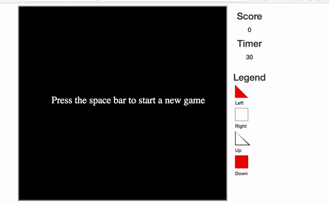

# Shapes Speed Game

This is a game that tests your speed and accuracy!

The game presents one of 4 shapes to you.  You must press the correct arrow key for the shape and color.  The correct keys are as follows:

* Red Triangle -> Left Arrow
* Red Square -> Down Arrow
* White Triangle -> Up Arrow
* White Square -> Right Arrow

If you press the wrong arrow for a shape, your score will be subtracted by 1 point.  If you press the correct arrow, your score will be increased by 1 point.

The goal of the game is to get the most points in 30 seconds.

Here is a demo of the game:

